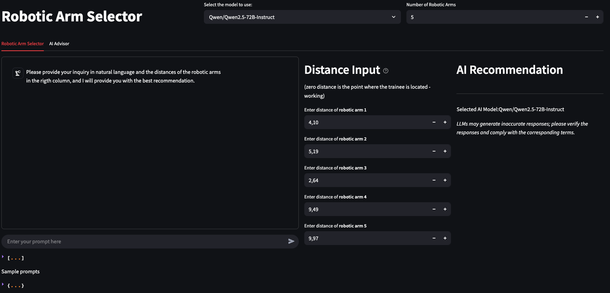

# Pilot Project Report: NLP-based Trainer

## 1 Objective

The primary aim of this pilot project was to create a streamlined, interactive interface enabling trainers to input high-level textual descriptions (prompts) regarding training scenarios involving virtual fires and robotic arm malfunctions. These inputs are processed by advanced language models (LLMs) to generate scenario recommendations, identify malfunctions, and support training decisions.

## 2 Overview of System

The system has been developed using Streamlit and comprises two key interface sections:

1. Robotic Arm Selector Tab  
2. AI Advisor Tab

### 2.1 Robotic Arm Selector Tab

This tab provides users (trainers) with the ability to:

- Select an LLM model, supporting both OpenAI and Hugging Face APIs (e.g., GPT-4o, Zephyr, Mistral).
- Dynamically input the number of robotic arms for the session.
- Submit textual prompts describing training scenarios.
- Enter distance values for each robotic arm relative to the trainee.

The system then:

- Processes the prompt and distances using the selected LLM.
- Returns structured JSON output indicating:
  - Which robotic arm may be experiencing a virtual fire.
  - Which arm is potentially malfunctioning.
  - An explanation for the AI’s decision.
- Displays example prompts to guide user input.
- Persists all session data for later analysis.


*Figure 1: Robotic Arm Selector Tab*

### 2.2 AI Advisor Tab

This tab supports two advanced functions:

1. Session Stress Result Retrieval: Connects to an external stress classification API to retrieve the participant’s emotional/stress performance based on physiological data.

2. Performance Report Generation: Uses the LLM to generate a markdown report incorporating:
   - Session metadata (date, time, participant ID)
   - Robotic arm distances
   - Malfunction and fire detection summary
   - Stress analysis results
   - Analytical tables and conclusions


Figure 2: AI Advisor Tab

## 3 System Components

### 3.1 Natural Language Interface

The platform leverages large language models (via OpenAI and Hugging Face) for prompt processing. The system dynamically constructs a structured prompt containing:

- Trainer’s textual input
- Robotic arm distance values
- Request for identification of robotic arm associated with virtual fire and malfunction

### 3.2 Distance Input Panel

Users can input precise numerical distances for each robotic arm. These values are used by the LLMs to make scenario inferences.

### 3.3 Model Integration

Models supported include:

- GPT-4o, GPT-4o-mini (OpenAI API)
- Zephyr-7b-beta, Mistral-7B-Instruct-v0.3, Qwen2.5-72B-Instruct (Hugging Face Inference API)

The list of models can be extended to include others.

### 3.4 Stress Analysis

The system queries a stress analysis API to retrieve a participant’s classification result for the session. It matches timestamps and participant IDs to fetch the correct entry.

## 4 Sample Output Format

```json
{
  "Robotic_Arm_Virtual_Fire": 1,
  "Robotic_Arm_Malfunctioning": 2,
  "Reason_of_selection": "Robotic Arm Number 1 is the closest to the base with a distance of 1.43, which aligns with the description of the virtual fire being 'close to the base.' Robotic Arm Number 2, at a distance of 7.79, is the farthest and matches the description of the arm 'moving erratically at a far distance,' indicating it is potentially malfunctioning."
}
```

Generated with OpenAI API (gpt-4o).

## 5 Usability and User Experience

- The interface is intuitive and provides real-time feedback.
- Prompts with fewer than 20 characters are disallowed to prevent vague input.
- Prompt inputs are stored and reused for report generation.
- Users can view AI model outputs in both JSON and Chat UI formats.

## 6 Challenges and Recommendations

- Challenge: Occasional JSON parsing failures from LLM responses.  
  Recommendation: Implement retry logic and more constrained prompt formatting.

- Challenge: Ambiguity in prompt interpretation when language is imprecise.  
  Recommendation: Enhance prompt scaffolding and allow iterative refinement.

## 7 Conclusion

The pilot project successfully demonstrated the feasibility of translating natural language trainer inputs into actionable XR training scenarios. The integration of multiple LLMs, combined with real-time data capture and post-session reporting, creates a powerful tool for enhancing safety training simulations.
